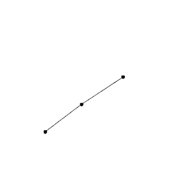

# `dyng` - Dynamic Graph Layout


The `dyng` library is a simple C++ library for dynamic graph layout.

## Quick start

Refer to [Quick start](docs/QUICK_START.md) to learn how to integrate this library in your project and how to use it.

## Graphic demo

See [How to compile the demo](RUNNING_DEMO.md) for a guide on how to compile a graphic demo showcasing the library.

 


## Full documentation

Full documentation can be generated using `Doxygen`. After executing following commands you can access the main page by opening `docs/docs.html`.

```bash
cd docs
doxygen
```

## License
The project is licensed under the Apache License, Version 2.0. See the accompanying file named [LICENSE](LICENSE).

## FAQ

### What was the motivation for creating this library?
This library is the outcome of my bachelor's thesis, which can be accessed [here](https://is.muni.cz/auth/th/ro22a/). (It's written in the Czech language.)

### What algorithms are used?

The library currently used a combination of these two algorithms:

- **Foresighted Layout with Tolerance**
Diehl S., Görg C. (2002) Graphs, They Are Changing. In: Goodrich M.T., Kobourov S.G. (eds) Graph Drawing. GD 2002. Lecture Notes in Computer Science, vol 2528. Springer, Berlin, Heidelberg
- **Fruchterman--Reingold**
Fruchterman, T.M., & Reingold, E.M. (1991). Graph Drawing by Force-directed Placement. Softw. Pract. Exp., 21, 1129-1164.

### Is the logo supposed to represent a flame?

Yes, it is.

### Why isn't the library named `dyngl` instead? (**DYN**amic **G**raph **L**ayout)

See [this](https://youtu.be/dQw4w9WgXcQ) for an answer.

