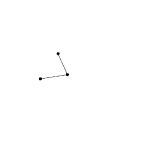

# **dyng** – Dynamic Graph Layout


The **dyng** library is a simple C++ library for dynamic graph layout.

## Graphic demo

See [How to compile the demo](RUNNING_DEMO.md) for a guide on how to compile a graphic demo showcasing the library.

 


## Quick start

Refer to [Quick start](docs/QUICK_START.md) to learn how to integrate this library in your project and how to use it.

## Documentation

Full [documentation](https://bleskocvok.github.io/dyng/html/index.html) is available online at https://bleskocvok.github.io/dyng/html/index.html.

Alternatively, it can be generated offline from the cloned repository using **Doxygen**:

```bash
cd docs
doxygen
```

After which the main page can be accessed by opening `docs/docs.html`.

## License
The project is licensed under the Apache License, Version 2.0. See the accompanying file named [LICENSE](LICENSE).

## FAQ

### What was the motivation for creating this library?
This library is the outcome of my bachelor's thesis, which can be accessed [here](https://is.muni.cz/th/ro22a/). (It's written in the Czech language.)

### What algorithms are used?

The library currently uses a combination of the two algorithms described in these papers:

- **Foresighted Layout with Tolerance**  
Diehl S., Görg C. (2002) Graphs, They Are Changing. In: Goodrich M.T., Kobourov S.G. (eds) Graph Drawing. GD 2002. Lecture Notes in Computer Science, vol 2528. Springer, Berlin, Heidelberg
- **Fruchterman–Reingold**  
Fruchterman, T.M., & Reingold, E.M. (1991). Graph Drawing by Force-directed Placement. Softw. Pract. Exp., 21, 1129-1164.

### What is the little logo supposed to represent?

A flaming graph.

### Why isn't the library named dyngl instead? (`DYN`amic `G`raph `L`ayout)

See [this](https://youtu.be/dQw4w9WgXcQ) for an answer.
